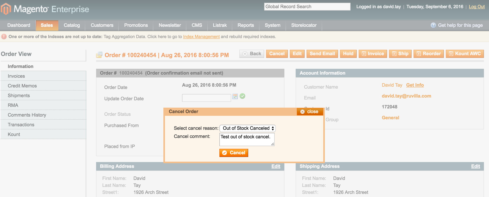
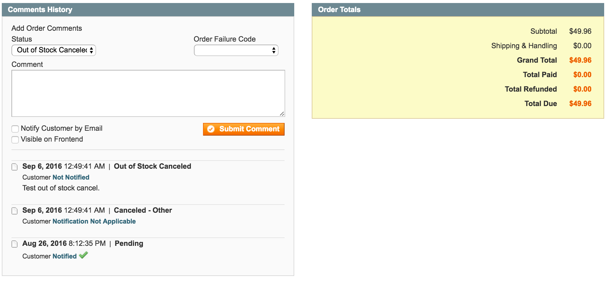

Cancel Status
=============
Provide a reason for order cancellation. 

Description
-----------
Cancel Status is a Magento extension for the store administrator to cancel an order 
and provide a reason for the cancellation. Cancellation statuses are created in the 
admin under System -> Order Statuses, and assigned to the cancel state. When 
cancelling an order, select from a popup of cancellation reasons:

After cancelling the order, the cancel reason and any comment will be added to the order 
comments history:

Install
-------
Modman:

<pre>
modman clone https://github.com/ExtensionsStore/CancelStatus
</pre>

Composer:

<pre>
{
    "require": {
        "magento-hackathon/magento-composer-installer": "dev-master",
    	"extensions-store/cancelstatus" : "1.0.0"
    },
    "repositories" : [
    	{
    		"type" : "vcs",
    		"url" : "https://github.com/ExtensionsStore/CancelStatus"
    	}  	
    ],
    "extra": {
        "magento-root-dir": "./html",
        "magento-deploystrategy": "copy",
        "magento-force" : true,
        "with-bootstrap-patch" : false
    }
}

</pre>

Support
-------
As this is a free extension, no support or guarantee is implied or provided. 
However, I can be contacted at https://www.extensions-store.com/support.html. 
Paid support including installation, configuration and custom development is 
available. Also, further development and updates are dependent on client support.
